# はじめに

## リファレンス

- https://kubernetes.io/docs/reference/generated/kubectl/kubectl-commands

## 環境構築

次を参考に環境を構築する。

- https://github.com/sasano8/zenn/blob/main/articles/infra-001-wsl.md

## アーキテクチャ



## 各コンポーネントの概要

### Pod

一つあるいは複数のコンテナを内包する、kubernetesにおけるコンテナの最小実行単位となるグループ。
このグループは、kubernetes上で論理的なホストとして振る舞う。

### Deployment

対等な関係がある複数のポッド。
サービスを停止せずに、稼働中のポッド置き換えなどで活用される。


NAME                               READY   STATUS             RESTARTS      AGE
pod/hello-world-649b9bfb9c-4mhhl   0/1     CrashLoopBackOff   5 (71s ago)   4m34s

NAME                 TYPE        CLUSTER-IP   EXTERNAL-IP   PORT(S)   AGE
service/kubernetes   ClusterIP   10.96.0.1    <none>        443/TCP   46h

NAME                          READY   UP-TO-DATE   AVAILABLE   AGE
deployment.apps/hello-world   0/1     1            0           36h

NAME                                     DESIRED   CURRENT   READY   AGE
replicaset.apps/hello-world-649b9bfb9c   1         1         0       36h


## 基本操作

k8sを起動する（minikubeの例）。

`kubernetes-version`は指定しないでよいが、不具合発生時などは安定バージョンを指定してみる。

```
minikube start --kubernetes-version=v1.23.8
```

キャッシュなどは次のフォルダで管理される。（TODO: プロジェクトごとにキャッシュフォルダを変えることはできる？）

```
ll ~/.kube
```

停止する時は次のコマンドを実行する。

```
minikube stop
```

バージョンを表示する。

```
kubectl version
```

クラスタ情報を表示する。

```
kubectl cluster-info
```

デプロイメントを実行する。

```
kubectl create deployment --image hello-world hello-world
# 非推奨: kubectl run hello-world --image=hello-world -it --restart=Never
# --restart: デフォルトはAlways
# --rm でcomplted時にpodを自動的に削除することができる
```

dockerにおける大体のコマンドは次の通り。

```
docker run hello-world
```

Podを削除する。

```
kubectl delete pod hello-world
```

ある名前空間（省略するとdefault）の全てのリソースを表示する。

```
kubectl get all -o wide --namespace=ingress
```

名前空間の一覧を表示する。

```
kubectl get namespace
```

任意のリソースを取得。

```
k get pod,deployment -o wide
```

使用できるリソースと省略形を確認する。

```
kubectl api-resources
```

podをスケールする。

```
kubectl create deployment --image=nginx nginx
kubectl scale --replicas=3 deployment/nginx
```

`replicas=0`はpodを再起動する際などに使用できる。

```
kubectl scale --replicas=0 deployment/nginx
kubectl scale --replicas=1 deployment/nginx
```

バッチ処理系のコンテナはジョブとして実行する。

```
kubectl create job hello-world --image=hello-world
```

対話型ポッドを起動する。

```
kubectl run busybox --image=busybox --restart=Never --rm -it sh
```

実行中コンテナへターミナル接続する。

```
kubectl exec --stdin --tty nginx -- /bin/bash
```


## マニフェスト

コマンドラインの代わりにマニフェストで各種リソースを定義することができる。


## ヘルスチェック

マニフェストにプロープを設定することでヘルスチェックを行い、状態に対して行う動作を制御できる。
デフォルトのプロープは設定されておらず、制御が無効になっている？？

### 活性プロープ（Liveness Probe）

コンテナが実行中であることを探査。失敗した場合は、コンテナを強制終了し再スタートさせる。

### 準備状態プロープ（Readiness Probe）

コンテナのアプリケーションがリクエストを受け取れるか探査する。失敗した場合は、サービスからのリクエストトラフィックを遮断する。


## 気になること

- kubernetesではdockerは非推奨！？
    - コンテナ・イメージを操作する時にdocker apiは非推奨で、CRI（Container Runtime Interface）を使え（一般層は意識しないでよい）という話
    - コンテナやイメージフォーマット（dockerなど）があり、それをCRIを介して操作する標準化の仕組みが整ってきている

## 非互換

- v1.25
    - PodSecurityPolicy (PSP) アドミッション コントローラーの削除。後継は、Pod Security Admission
