# はじめに

## リファレンス

- https://kubernetes.io/docs/reference/generated/kubectl/kubectl-commands

## 環境構築

次を参考に環境を構築する。

- https://github.com/sasano8/zenn/blob/main/articles/infra-001-wsl.md

## アーキテクチャ



## 各コンポーネントの概要

### Pod

一つあるいは複数のコンテナを内包する、kubernetesにおけるコンテナの最小実行単位となるグループ。
このグループは、kubernetes上で論理的なホストとして振る舞う。

### Deployment

対等な関係がある複数のポッド。
サービスを停止せずに、稼働中のポッド置き換えなどで活用される。

## チュートリアル

Podを実行する。

```
kubectl run hello-world --image=hello-world -it --restart=Always
# restart: デフォルトはAlways
```

`run`コマンドは多くの役割を担っており、機能の肥大化が理由でポッド起動時を除き非推奨となった。
代替コマンドは、次の通りです。

```
kubectl create deployment --image hello-world hello-world
```


Podを削除する。

```
kubectl delete pod hello-world
```